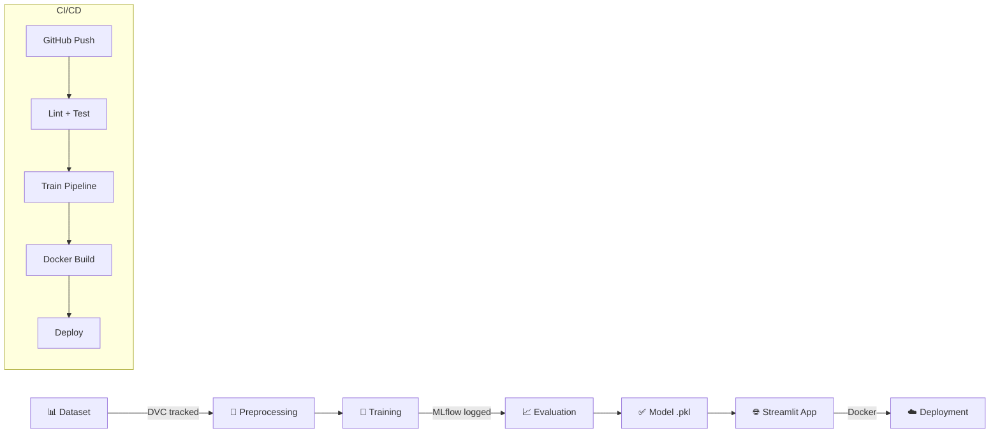

# 🌾 NPK Crop Intelligence — MLOps Edition

[](https://github.com/ZeniTsuisSimp/NPK-LIVE/actions/workflows/ci.yml)
[](https://huggingface.co/spaces/ZeniTsuisSimp/npk-crop-recommendation)


Smart soil analysis and crop recommendation system powered by **Machine Learning**, built with **MLOps best practices** — DVC, MLflow, Docker, and CI/CD.

---

## 🏗️ Architecture



## 📂 Project Structure

```
NPK-LIVE/
├── .github/workflows/      # CI/CD pipelines
│   ├── ci.yml               # Lint, test, train on push/PR
│   └── cd.yml               # Docker build + deploy on main
├── src/                     # Modular ML pipeline
│   ├── data_preprocessing.py
│   ├── train.py             # MLflow-integrated training
│   └── evaluate.py          # Metrics generation
├── app/                     # Streamlit application
│   └── npk_crop_recommendation_app.py
├── tests/                   # Unit tests
│   └── test_pipeline.py
├── data/                    # Raw dataset
│   └── Crop_recommendation.csv
├── models/                  # Trained model artifacts
│   └── npk_crop_model.pkl
├── notebooks/               # Jupyter notebooks
├── reports/                 # Auto-generated metrics
├── params.yaml              # Hyperparameter config
├── dvc.yaml                 # DVC pipeline stages
├── Dockerfile               # Container config
├── docker-compose.yml       # Docker Compose
├── requirements.txt         # Production deps
└── requirements-dev.txt     # Dev/test deps
```

## 🚀 Quick Start

### 1. Clone & Install
```bash
git clone https://github.com/ZeniTsuisSimp/NPK-LIVE.git
cd NPK-LIVE
pip install -r requirements.txt
pip install -r requirements-dev.txt
pip install -e .
```

### 2. Run the ML Pipeline
```bash
# Step-by-step
python -m src.data_preprocessing
python -m src.train
python -m src.evaluate

# Or use DVC
dvc repro
```

### 3. Launch the App
```bash
streamlit run app/npk_crop_recommendation_app.py
```

### 4. Run with Docker
```bash
docker-compose up --build
# Visit http://localhost:8501
```

## 🔬 MLOps Stack

| Tool | Purpose |
|------|---------|
| **MLflow** | Experiment tracking (params, metrics, model artifacts) |
| **DVC** | Data versioning & reproducible pipelines |
| **Docker** | Containerized deployment |
| **GitHub Actions** | CI (lint + test) and CD (Docker + deploy) |
| **pytest** | Unit testing |
| **flake8** | Code linting |

### View MLflow Experiments
```bash
mlflow ui
# Visit http://localhost:5000
```

### Run DVC Pipeline
```bash
dvc repro           # Run full pipeline
dvc metrics show    # View latest metrics
dvc dag             # Visualize pipeline DAG
```

## 🧪 Testing
```bash
pytest tests/ -v
```

## 🔄 CI/CD Pipeline

### CI (on every push/PR)
1. **Lint** — `flake8` syntax & style checks
2. **Test** — `pytest` unit tests
3. **Train** — Full preprocessing → training → evaluation
4. **Verify** — Model and metrics artifacts exist

### GitHub Secrets Required
- `HF_USERNAME` — Hugging Face username
- `HF_TOKEN` — Hugging Face Write Token

## 📊 App Features

- 🌾 **Crop Prediction** — ML-based crop recommendation from soil NPK values
- 🧪 **NPK Additions** — Calculate nutrient amendments for target crops
- 🔄 **Crop Rotation Advisor** — Science-based next-crop suggestions
- 💚 **Soil Health Score** — Composite 0-100 health rating with radar chart
- 📅 **Seasonal Calendar** — Indian Kharif/Rabi/Zaid crop calendar
- 📈 **NPK History** — Track soil readings over time

## 📋 Model Details

| Parameter | Value |
|-----------|-------|
| Algorithm | Random Forest Classifier |
| Features | N, P, K (mg/kg) |
| Crops | Rice, Wheat, Corn, Barley, Soybean, Cotton, Sugarcane, Tomato, Potato, Onion |
| Config | `params.yaml` |

---

*Built with ❤️ using Streamlit, scikit-learn, MLflow, and DVC*
